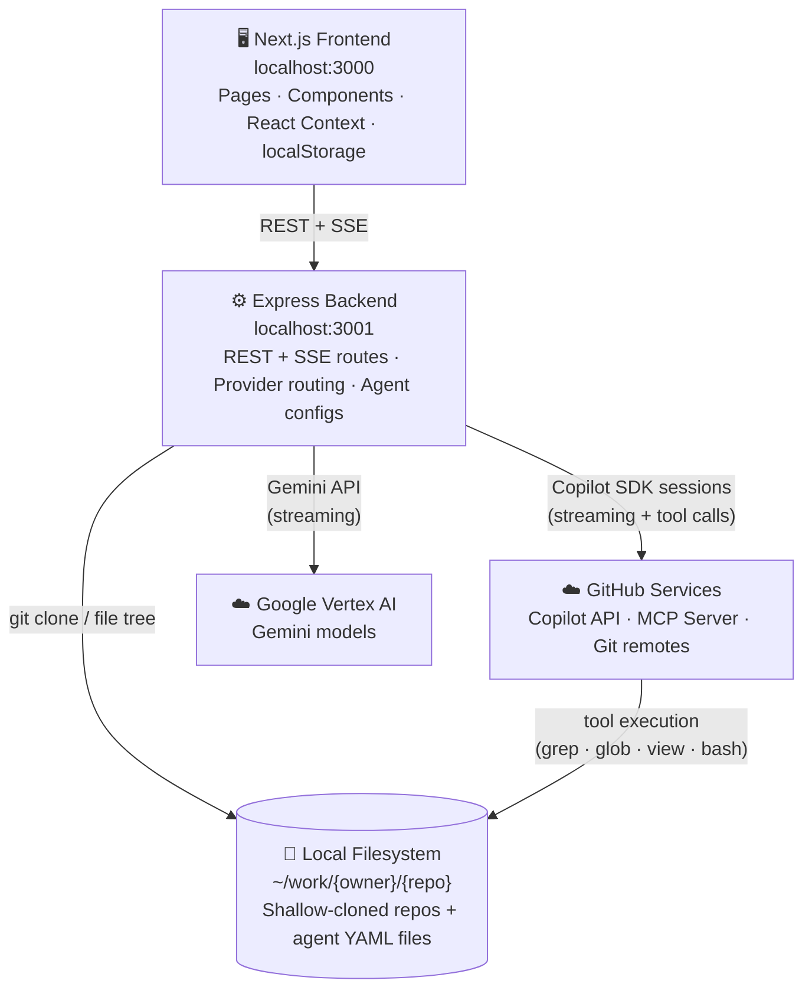
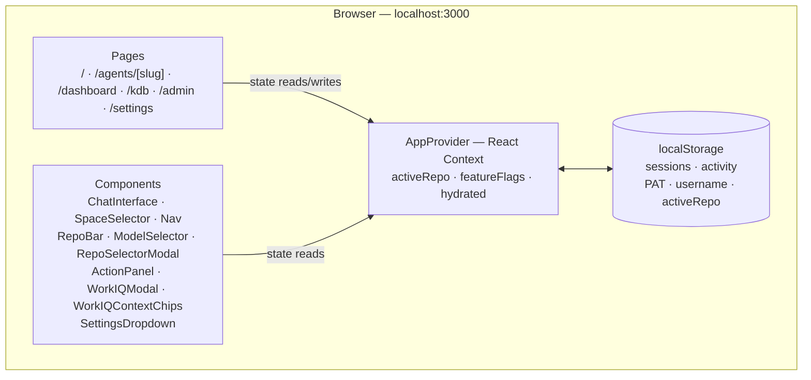
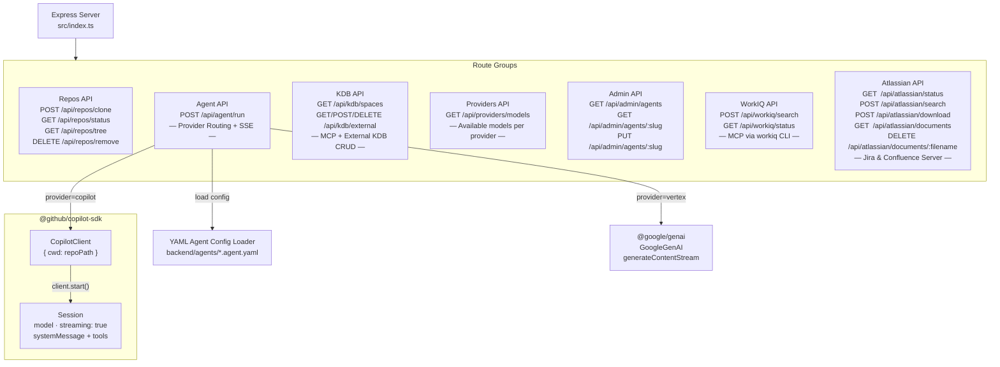
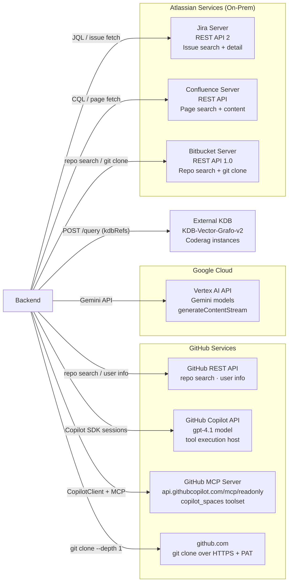
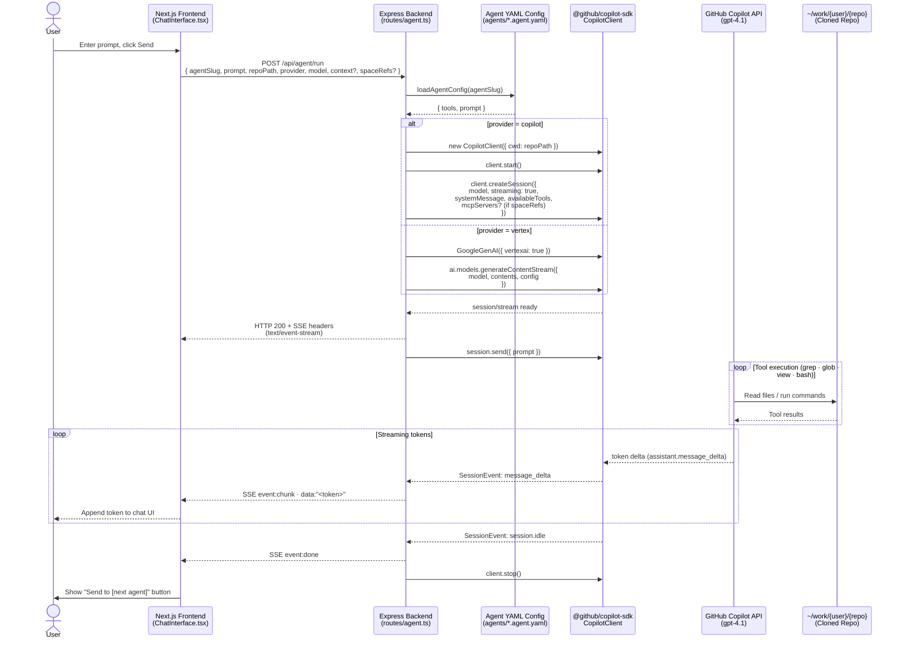
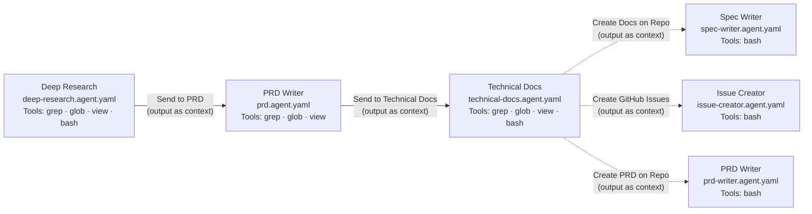

# Architecture

This document describes the system architecture of **Web-Spec** — how the frontend, backend, GitHub Copilot SDK, and external services interact.

---

## System Overview

The system has three layers: a **browser-based frontend**, a **stateless backend**, and **external AI/cloud services**. The backend bridges the frontend to LLM providers (GitHub Copilot SDK and Google Vertex AI) and the local filesystem. LLM credentials are configured as backend environment variables — no secrets are stored in the browser.



### Frontend Internals

The Next.js 14 App Router frontend manages all user-facing state in React Context backed by `localStorage` — no server-side persistence.



### Backend Internals

The Express backend exposes route groups behind a single server. Agent execution routes to either the `@github/copilot-sdk` (Copilot provider) or `@google/genai` (Vertex AI provider) based on the `provider` field in the request.



### External Services

The backend and frontend communicate with external services. GitHub repo operations (clone, search) are proxied through the backend using the server-side PAT. The backend routes agent requests to either GitHub Copilot or Google Vertex AI based on the user's provider selection.



---

## Agent Run — Sequence Diagram

This diagram shows the exact sequence of calls when a user submits a prompt to an agent.



---

## Agent Pipeline

Agents are chained — the output of one session can be forwarded as `context` to the next agent's system prompt.



The three analysis agents (deep-research, prd, technical-docs) use model `o4-mini`. The three action agents (spec-writer, prd-writer, issue-creator) use model `gpt-4.1` and run with `cwd` set to the cloned repository. The action agents are triggered by post-action buttons on the Technical Docs page — they receive the tech-docs output as `context` and use `bash` to create branches/files, PRDs, or GitHub issues via `gh` CLI.

---

## Component Responsibilities

| Layer | Technology | Responsibility |
|-------|-----------|----------------|
| Frontend pages | Next.js 14 App Router | Routing, SSE consumption, UI rendering |
| Frontend state | React Context + localStorage | Active repo, sessions, activity log, feature flags |
| Model selector | `ModelSelector` component | Fetches available models from backend, persists selection in `sessionStorage` |
| Admin page | `/admin` client component | View/edit agent YAML configs (displayName, description, model, tools, prompt) via REST API |
| Action panel | `ActionPanel` modal component | Stream action agent output (spec-writer, issue-creator) in a modal overlay |
| Backend server | Express 4 + TypeScript | HTTP routing, CORS, request validation |
| Admin API | `routes/admin.ts` + `routes/agents.ts` | Full CRUD endpoints for agents; backed by SQLite DB |
| Repo management | `child_process.execSync` + `git` | Shallow clone, file tree, removal |
| Agent execution | Provider routing in `agent.ts` | Routes to `copilot-runner.ts` (Copilot SDK) or `vertex-runner.ts` (Gemini) based on `provider` field |
| Copilot runner | `@github/copilot-sdk` `CopilotClient` | Session lifecycle, prompt dispatch, tool delegation, MCP server integration |
| Vertex runner | `@google/genai` `GoogleGenAI` | Streaming content generation via Gemini models |
| SSE proxy | Next.js Route Handler (`app/api/agent/run/route.ts`) | Bypasses rewrite-proxy buffering; pipes backend `ReadableStream` directly to client |
| Streaming transport | Server-Sent Events (SSE) | Token-by-token delivery from Copilot API to browser |
| Agent config | SQLite database (`backend/data/agents.db`) via `db.ts` + `seed.ts` | Model, tools, system prompt, UI metadata per agent |
| Model backend | GitHub Copilot API + Google Vertex AI | LLM inference; Copilot has tool call execution, Vertex streams text only |
| Feature flags | `/settings` page + `storage.ts` | Toggle visibility of KDB, WorkIQ, and action buttons; persisted in `localStorage` |
| Quick prompts | Agent chat page | One-click prompt buttons on PRD and Technical Docs agents for context-based auto-fill |
| Settings dropdown | `SettingsDropdown` component | Menu with Admin link and Feature Flags link |
| WorkIQ client | `workiq-client.ts` | Singleton MCP client managing `workiq mcp` stdio subprocess for M365 data search |
| WorkIQ routes | `routes/workiq.ts` | Search, detail, and status endpoints proxying to WorkIQ MCP |
| Repo caching | `repo-cache.ts` + `spaces-cache.ts` | Client-side caching for repository data and Copilot Spaces (5-min TTL) |
| Atlassian client | `atlassian-client.ts` | Auth helpers for Jira/Confluence Server — PAT headers, URL normalization, service status |
| Atlassian routes | `routes/atlassian.ts` + `routes/atlassian-download.ts` | Search (JQL/CQL), download (issues/pages), document list/delete |
| Confluence parser | `confluence-parser.ts` | HTML → Markdown conversion using Cheerio + Turndown for Confluence page content |
| Document store | `document-store.ts` | File-based storage for downloaded Atlassian docs in `{WORK_DIR}/context/atlassian/` |
| Context gatherer | `context-gatherer.ts` | Parallel context source orchestration via `Promise.allSettled` for agent prompt enrichment |
| Atlassian selector | `AtlassianSelector` component | Toolbar dropdown for searching Jira/Confluence, selecting items, and downloading as context |

---

## Data Flow Summary

1. **User** selects a repository in the frontend.
2. **Frontend** calls `POST /api/repos/clone` → backend runs `git clone --depth 1` into `~/work/{owner}/{repo}`.
3. **User** picks an agent, selects a provider/model, and submits a prompt.
4. **Frontend** opens an SSE connection via `POST /api/agent/run` with `provider` and `model`.
5. **Backend** reads the agent config, routes to the selected LLM provider (Copilot SDK or Vertex AI), and starts streaming.
6. **GitHub Copilot API** receives the system prompt + user message, executes tool calls (`grep`, `glob`, `view`, `bash`) directly against the repo filesystem, and streams tokens back.
7. **Backend** forwards each `message_delta` event as an SSE `chunk` event.
8. **Frontend** renders tokens in real time. On completion, a "Send to [next agent]" button appears, passing the full response as `context` to the next agent in the chain.
9. **Action agents** — From the Technical Docs page, users can trigger action agents (Spec Writer, PRD Writer, Issue Creator) via post-action buttons. These stream through the same SSE pipeline but execute write operations (git branches, file creation, PRs, GitHub issues) against the repository.

---

## Context Gathering

Agent system prompts are enriched with context from multiple sources. The `context-gatherer.ts` module implements a parallelization pattern using `Promise.allSettled()` — all independent sources are fetched concurrently, and a single source failure is logged and skipped without aborting the agent run.

**Registered context sources** (in prompt order):

| Source | Trigger | Data |
|--------|---------|------|
| **Handoff** | Previous agent output passed as `context` | Full text of prior agent response |
| **Copilot Spaces** | `spaceRefs` array + Copilot provider | Instruction to use `github-get_copilot_space` tool |
| **WorkIQ** | `workiqContext` items from Microsoft 365 | Emails, meetings, docs, Teams messages (4000 char cap) |
| **KDB** | `kdbRefs` pointing to external KDB instances | RAG query results from KDB-Vector-Grafo |
| **Atlassian** | Downloaded Jira/Confluence documents in `{WORK_DIR}/context/atlassian/` | Issue details, page content as Markdown (8000 char cap) |

Adding a new context source requires only: (1) implementing a `gather()` async function, (2) registering a `ContextSource` in the conditional block in `agent.ts`.

---

## Copilot Spaces via MCP

The Knowledge Base page lists the user's Copilot Spaces by creating a short-lived `CopilotClient` session configured with the GitHub MCP server (`https://api.githubcopilot.com/mcp/readonly`) and the `copilot_spaces` toolset (via the `X-MCP-Toolsets` header). The environment variables `COPILOT_MCP_COPILOT_SPACES_ENABLED=true` and `GITHUB_PERSONAL_ACCESS_TOKEN` must be set on the CopilotClient's env to enable the built-in MCP space tools (`github-list_copilot_spaces`, `github-get_copilot_space`). This takes 10-30 seconds due to the LLM round-trip.

Users can select one or more Copilot Spaces directly from the chat input area using the `SpaceSelector` component. The selected space references (`owner/name` strings) are passed as `spaceRefs: string[]` in `POST /api/agent/run` requests. The backend conditionally attaches the `copilot_spaces` MCP server to the agent session and appends a system prompt instruction listing all selected spaces, instructing the agent to call `get_copilot_space` for each one. The legacy single `spaceRef` parameter is still accepted for backward compatibility and normalized into the array internally.

MCP permission requests (`kind: "mcp"`) are auto-approved in both the KDB listing and agent sessions. Non-MCP permission requests are denied by rules.

---

## WorkIQ Context Integration (Microsoft 365)

Users can search their Microsoft 365 data (emails, meetings, documents, Teams messages, people) from any agent chat page and attach results as hidden context.

### Architecture

```
Frontend (ChatInterface)                   Backend
┌──────────────────────┐          ┌──────────────────────────┐
│ WorkIQ button         │          │ GET  /api/workiq/status   │
│ WorkIQModal (search)  │────────> │ POST /api/workiq/search   │
│ WorkIQContextChips    │          │         │                  │
│     ↓ onSend          │          │    workiq-client.ts        │
│ workiqContext field    │────────> │    (MCP stdio singleton)   │
│  in /api/agent/run    │          │         │                  │
└──────────────────────┘          │   workiq mcp (CLI)         │
                                  └──────────────────────────┘
```

- **Backend**: `workiq-client.ts` manages a singleton MCP client that spawns `workiq mcp` via stdio transport. The `workiqRouter` (`routes/workiq.ts`) exposes `POST /search` and `GET /status` endpoints. The MCP process is lazy-started on first request and auto-restarts on crash.
- **Frontend**: `WorkIQModal` provides search with 400ms debounce. `WorkIQContextChips` renders attached items as removable pills above the textarea. `lib/workiq.ts` caches availability status for 5 minutes.
- **Context forwarding**: Selected items are passed as `workiqContext` in the `/api/agent/run` request body. The backend appends them to the system prompt as a labeled block after handoff context and before space instructions. Total WorkIQ context is capped at ~4000 characters.
- **Graceful degradation**: If `workiq` CLI is not installed, the status endpoint returns `{ available: false }` and the frontend hides the button entirely.
