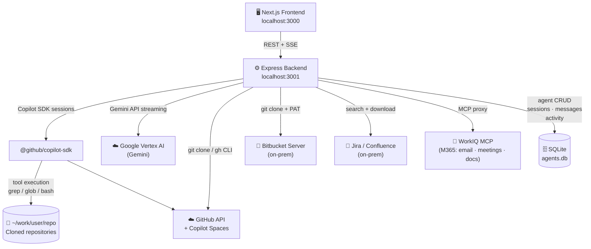
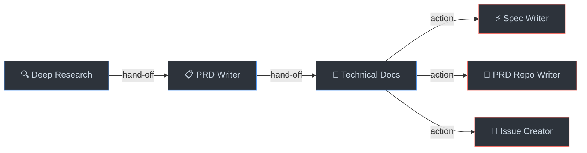

# agentic-react

**agentic-react** bridges the gap between business users and AI-powered software development. By wrapping GitHub Copilot's agentic capabilities in a clean, intuitive interface, it empowers product managers, business analysts, and stakeholders to actively participate in the Software Development Lifecycle — no IDE or CLI required.

Simply point it at any GitHub or Bitbucket repository, describe what you need, and a chained pipeline of AI agents does the heavy lifting:

- 🔍 **Deep Research** — understands the existing codebase.
- 📋 **PRD Writer** — translates ideas into product requirements.
- 📐 **Technical Docs** — produces developer-ready specifications.

Each agent hands off its output to the next, streaming results in real time. The result? Business users can drive spec creation, align with engineering early, and accelerate delivery — turning GitHub Copilot from a developer tool into a shared team superpower.

---

## Table of Contents

- [agentic-react](#agentic-react)
  - [Features](#features)
  - [Architecture](#architecture)
  - [Technology Stack](#technology-stack)
  - [Getting Started](#getting-started)
  - [Project Structure](#project-structure)
  - [Agents](#agents)
  - [API Reference](#api-reference)
  - [Environment Variables](#environment-variables)
  - [Development](#development)
  - [Testing](#testing)
  - [Contributing](#contributing)
  - [License](#license)

---

## Features

- **6 AI agents** — Deep Research → PRD Writer → Technical Docs form the analysis pipeline, with Spec Writer, PRD Repo Writer, and Issue Creator as action agents
- **3 action agents** — Spec Writer creates spec branches/PRs, PRD Repo Writer creates PRD docs on repo, Issue Creator creates GitHub issues — all triggered from post-action buttons
- **Repository targeting** — search and clone any GitHub or Bitbucket Server repository; agents run directly inside the cloned repo
- **Streaming chat** — real-time SSE streaming powered by the GitHub Copilot SDK and Google Vertex AI
- **Agent handoff** — forward one agent's output as context to the next with a single click
- **Knowledge Base (KDB)** — attach Copilot Spaces or external KDB-Vector-Grafo instances to inject reference context into agent sessions
- **Atlassian integration** — search Jira issues and Confluence pages, download them as Markdown context documents, auto-inject into agent sessions
- **WorkIQ integration** — search Microsoft 365 data (emails, meetings, documents, Teams) and attach results as context
- **Parallel context gathering** — all context sources (handoff, Copilot Spaces, WorkIQ, KDB, Atlassian) are fetched concurrently via `Promise.allSettled` — a single source failure never aborts a run
- **Multi-provider LLM** — choose between GitHub Copilot and Google Vertex AI (Gemini) at runtime via the model selector in the agent page header
- **Dashboard** — session history and activity log persisted in **SQLite** (backend); per-session and bulk delete, per-session export to Markdown
- **Admin panel** — create, view, and edit agents (model, tools, prompt) at runtime from `/admin/agents` — backed by SQLite
- **Feature flags** — toggle visibility of KDB, WorkIQ, Atlassian, and action buttons from `/settings`
- **Quick prompts** — one-click prompt buttons on PRD and Technical Docs agents to auto-fill context-based prompts
- **Bitbucket Server support** — clone and search Bitbucket Server repositories with PAT-based auth and self-signed SSL support
- **Server-side auth** — all LLM and integration credentials live in `backend/.env` — no secrets stored in the browser

---

## Architecture



| Layer | Responsibilities |
|---|---|
| **Frontend** | `/` Agent selector · `/agents/[slug]` Streaming chat · `/dashboard` Session history · `/kdb` Knowledge Base · `/settings` Feature flags · `/admin/agents` Agent CRUD editor. Active-repo state via `AppProvider` (React Context) + `localStorage`; sessions/messages/activity fetched from the backend API. |
| **Backend** | REST + SSE API. Clones repos via `gh` (GitHub) or `git` (Bitbucket). Routes agent runs to Copilot SDK or Vertex AI. Proxies Atlassian, WorkIQ, and KDB requests. Persists agent configs, sessions, messages, and activity events in SQLite. |
| **Copilot SDK** | Agent sessions via `@github/copilot-sdk` with tool permissions (grep, glob, view, bash) defined per agent in the database. |
| **Vertex AI** | Gemini models via `@google/genai` — same SSE streaming interface as Copilot, selectable at runtime. |
| **Atlassian** | Jira issue + Confluence page search; pages are converted to Markdown via Turndown and stored as context documents on disk. |
| **WorkIQ** | M365 queries (emails, meetings, docs, Teams) proxied via the WorkIQ MCP CLI and injected as agent context. |

The backend persists **agent configs, sessions, messages, and activity events** in `agents.db` (SQLite). The only client-side state is the active repository selection, stored in `localStorage`.

For detailed sequence diagrams see [ARCHITECTURE.md](ARCHITECTURE.md).

---

## Technology Stack

| Layer | Technology |
|---|---|
| **Frontend framework** | Next.js 16 (App Router, Turbopack) |
| **UI language** | React 18, TypeScript 5 |
| **Styling** | Tailwind CSS 3.4 |
| **Icons** | Lucide React ^0.462 |
| **Markdown rendering** | react-markdown ^10.1, remark-gfm ^4.0 |
| **Linting** | ESLint (via Next.js) |
| **Backend runtime** | Node.js 18+ (ESM — `"type": "module"`) |
| **Backend framework** | Express 4.21 |
| **Backend language** | TypeScript 5 (ES2022, NodeNext) |
| **AI SDK (Copilot)** | @github/copilot-sdk ^0.1.25 |
| **AI SDK (Vertex)** | @google/genai ^1.45 |
| **MCP client** | @modelcontextprotocol/sdk ^1.27 |
| **Database** | better-sqlite3 ^12.8 (SQLite — agent configs) |
| **HTML → Markdown** | turndown ^7.2 + cheerio ^1.2 (Atlassian doc conversion) |
| **Agent config** | YAML ^2.8 (seed files only) |
| **Dev tooling** | nodemon, tsx, concurrently ^9 |
| **Monorepo** | npm workspaces |

---

## Getting Started

### Prerequisites

| Requirement | Version | Notes |
|---|---|---|
| Node.js | 18+ | [nodejs.org](https://nodejs.org) |
| GitHub CLI (`gh`) | Latest | [cli.github.com](https://cli.github.com) — must be authenticated (`gh auth login`) |
| GitHub Personal Access Token | — | See token requirements below — [create one](https://github.com/settings/tokens/new) |

#### PAT Permissions

**Classic token** — check these scopes: `repo`, `read:user`, `copilot`

**Fine-grained token** — select the following:
- *Account permissions*: **Copilot Editor Chat** → Read-only
- *Repository permissions*: **Contents** → Read-only, **Metadata** → Read-only (auto-selected)

> Fine-grained tokens must be scoped to your personal account (not just an org) for the Copilot Spaces API to work.

### Install

From the repository root, install dependencies for all workspaces at once:

```bash
npm run install:all
```

Or equivalently:

```bash
npm install --workspaces --include-workspace-root
```

### Run

**Option A — single command from the root (recommended)**

```bash
npm run dev
```

This uses `concurrently` to start both the frontend (port 3000) and backend (port 3001) in a single terminal session.

**Option B — two separate terminals**

```bash
# Terminal 1 — Backend (port 3001)
cd backend
npm run dev
```

```bash
# Terminal 2 — Frontend (port 3000)
cd frontend
npm run dev
```

Then open [http://localhost:3000](http://localhost:3000) in your browser.

### First-Time Setup

1. Copy `backend/.env.example` to `backend/.env` and configure at least one LLM provider (see [Environment Variables](#environment-variables)).
2. Click **Select repo** in the repository bar, search for a GitHub repository, and select it — it will be cloned automatically to `~/work/{owner}/{repo}`.
3. Choose an agent from the landing page, pick a provider/model from the **model selector in the page header**, and start chatting.
4. *(Optional)* Configure Atlassian and/or WorkIQ credentials to unlock additional context sources.

---

## Project Structure

```
agentic-react/
├── package.json                    # npm workspaces root
├── README.md
├── ARCHITECTURE.md
├── frontend/                       # Next.js 16 application (port 3000)
│   ├── app/
│   │   ├── layout.tsx              # Root layout — Nav + RepoBar
│   │   ├── page.tsx                # Agent selector landing page
│   │   ├── globals.css
│   │   ├── api/
│   │   │   ├── agent/run/route.ts  # SSE proxy → backend /api/agent/run
│   │   │   └── backend/workiq/search/route.ts  # WorkIQ proxy (90 s timeout)
│   │   ├── agents/[slug]/page.tsx  # Dynamic agent chat page
│   │   ├── admin/
│   │   │   ├── page.tsx            # Admin landing
│   │   │   └── agents/page.tsx     # Agent CRUD UI
│   │   ├── dashboard/page.tsx      # Session history + activity log
│   │   ├── kdb/page.tsx            # Knowledge Base / Copilot Spaces
│   │   └── settings/page.tsx       # Feature flags toggle panel
│   ├── components/
│   │   ├── ChatInterface.tsx       # Streaming chat UI
│   │   ├── Nav.tsx                 # Top navigation bar
│   │   ├── RepoBar.tsx             # Active repository status bar
│   │   ├── ModelSelector.tsx       # LLM provider and model picker
│   │   ├── RepoSelectorModal.tsx   # Repository search and clone modal
│   │   ├── ActionPanel.tsx         # Streaming action agent modal
│   │   ├── AgentForm.tsx           # Agent create/edit form (Admin)
│   │   ├── SpaceSelector.tsx       # Multi-select Copilot Spaces
│   │   ├── KDBSelector.tsx         # External KDB selector
│   │   ├── AtlassianSelector.tsx   # Jira/Confluence context selector
│   │   ├── WorkIQModal.tsx         # WorkIQ search & context picker
│   │   ├── WorkIQContextChips.tsx  # Attached WorkIQ context display
│   │   └── SettingsDropdown.tsx    # User settings menu
│   └── lib/
│       ├── agents.ts               # AgentConfig type + helpers
│       ├── agents-api.ts           # REST client for /api/agents
│       ├── sessions-api.ts         # REST client for /api/sessions + /api/activity
│       ├── export.ts               # sessionToMarkdown + downloadMarkdown helpers
│       ├── storage.ts              # localStorage helpers (SSR-safe, active repo only)
│       ├── context.tsx             # AppProvider — global React context
│       ├── repo-cache.ts           # Repository search cache
│       ├── spaces-cache.ts         # Copilot Spaces cache (5-min TTL)
│       ├── kdb-cache.ts            # External KDB list cache
│       └── workiq.ts               # WorkIQ availability checker
├── backend/                        # Express API server (port 3001)
│   ├── agents/                     # YAML seed files (first-run only)
│   │   ├── deep-research.agent.yaml
│   │   ├── prd.agent.yaml
│   │   ├── technical-docs.agent.yaml
│   │   ├── spec-writer.agent.yaml
│   │   ├── prd-writer.agent.yaml
│   │   └── issue-creator.agent.yaml
│   ├── data/                       # SQLite database (git-ignored at runtime)
│   └── src/
│       ├── index.ts                # Server entry — registers all routers
│       ├── lib/
│       │   ├── db.ts               # SQLite setup (agents + external_kdbs)
│       │   ├── providers.ts        # LLM provider credential reader
│       │   ├── copilot-runner.ts   # GitHub Copilot SDK execution
│       │   ├── vertex-runner.ts    # Google Vertex AI (Gemini) execution
│       │   ├── context-gatherer.ts # Parallel context aggregation
│       │   ├── kdb-query.ts        # External KDB vector query helper
│       │   ├── seed.ts             # Seeds agents from YAML on first run
│       │   ├── workiq-client.ts    # WorkIQ MCP client singleton
│       │   └── atlassian/
│       │       ├── atlassian-client.ts   # Jira + Confluence API client
│       │       ├── confluence-parser.ts  # Confluence HTML → Markdown
│       │       └── document-store.ts     # Downloaded document file store
│       └── routes/
│           ├── repos.ts            # clone · status · remove · tree · search · me
│           ├── agent.ts            # POST /run — SSE streaming (provider routing)
│           ├── agents.ts           # CRUD /api/agents
│           ├── providers.ts        # GET /models
│           ├── sessions.ts         # CRUD /api/sessions · /api/activity
│           ├── kdb.ts              # GET /spaces (Copilot Spaces proxy)
│           ├── kdb-external.ts     # CRUD /api/kdb/external
│           ├── atlassian.ts        # GET /status · POST /search
│           ├── atlassian-download.ts # POST /download · GET+DELETE /documents
│           ├── workiq.ts           # POST /search · GET /status
│           └── admin.ts            # Legacy agent endpoints (delegates to DB)
└── reference/                      # Reference materials and sample data
```

---

## Agents

Agents are stored in a **SQLite database** (`backend/data/agents.db`). On first startup, the backend seeds the database from the YAML files in `backend/agents/`. After seeding, the database is the single source of truth — YAML files are not read at runtime.

Agents can be managed via:
- **Admin UI** at `/admin/agents` — full CRUD with a visual form
- **REST API** — `GET/POST/PUT/DELETE /api/agents`

### Agent Pipeline



The three **action agents** (Spec Writer, PRD Repo Writer, Issue Creator) are triggered from buttons on the Technical Docs chat page. They receive the tech-docs output as context and execute write operations against the target repository.

### Agent Details

| Agent | Slug | Default Model | Tools | Description |
|---|---|---|---|---|
| **Deep Research** | `deep-research` | o4-mini | grep, glob, view, bash | Analyzes codebase structure, technology constraints, patterns, and dependencies |
| **PRD Writer** | `prd` | o4-mini | grep, glob, view | Consumes research output and generates a structured Product Requirements Document |
| **Technical Docs** | `technical-docs` | o4-mini | grep, glob, view, bash | Produces implementation task breakdowns and technical specifications |
| **Spec Writer** | `spec-writer` | gpt-4.1 | bash | Creates a spec branch with `spec.md` + story files, commits, and opens a PR |
| **PRD Repo Writer** | `prd-writer` | gpt-4.1 | bash | Creates a PRD markdown file on a branch and opens a PR |
| **Issue Creator** | `issue-creator` | gpt-4.1 | bash | Creates hierarchical GitHub issues (parent + sub-issues) via `gh` CLI |

---

## API Reference

All API endpoints are served by the backend on port `3001`.

### Repositories

| Method | Endpoint | Description |
|---|---|---|
| `POST` | `/api/repos/clone` | Clone a repository into `~/work/{owner}/{repo}` |
| `GET` | `/api/repos/status` | Check whether a repository has already been cloned |
| `DELETE` | `/api/repos/remove` | Remove a cloned repository from disk |
| `GET` | `/api/repos/tree` | Return the file tree of a cloned repository |
| `GET` | `/api/repos/search?q=` | Search GitHub repositories (server-side PAT) |
| `GET` | `/api/repos/me` | Get authenticated GitHub username from env PAT |

### Agent Execution

| Method | Endpoint | Description |
|---|---|---|
| `POST` | `/api/agent/run` | Start an agent session; streams SSE tokens (`chunk`, `reasoning`, `done`, `error`) |
| `GET` | `/api/providers/models` | List available models grouped by configured provider |

### Agent Management

| Method | Endpoint | Description |
|---|---|---|
| `GET` | `/api/agents` | List all agents |
| `GET` | `/api/agents/:slug` | Get a single agent |
| `POST` | `/api/agents` | Create a new agent |
| `PUT` | `/api/agents/:slug` | Update an agent |
| `DELETE` | `/api/agents/:slug` | Delete an agent |
| `GET` | `/api/admin/agents` | Legacy: list agents (delegates to DB) |
| `GET` | `/api/admin/agents/:slug` | Legacy: get agent (delegates to DB) |
| `PUT` | `/api/admin/agents/:slug` | Legacy: update agent (delegates to DB) |

### Knowledge Base

| Method | Endpoint | Description |
|---|---|---|
| `GET` | `/api/kdb/spaces` | Proxy — fetch GitHub Copilot Spaces (avoids CORS) |
| `GET` | `/api/kdb/external` | List saved external KDB instances |
| `POST` | `/api/kdb/external` | Add an external KDB instance |
| `DELETE` | `/api/kdb/external/:id` | Remove an external KDB instance |

### Atlassian (Jira + Confluence)

| Method | Endpoint | Description |
|---|---|---|
| `GET` | `/api/atlassian/status` | Check if Atlassian credentials are configured |
| `POST` | `/api/atlassian/search` | Search Jira issues and Confluence pages |
| `POST` | `/api/atlassian/download` | Download a Confluence page as a Markdown context document |
| `GET` | `/api/atlassian/documents` | List downloaded Atlassian documents |
| `DELETE` | `/api/atlassian/documents/:filename` | Delete a downloaded document |

### WorkIQ (Microsoft 365)

| Method | Endpoint | Description |
|---|---|---|
| `POST` | `/api/workiq/search` | Search M365 data via WorkIQ MCP CLI |
| `GET` | `/api/workiq/status` | Check if WorkIQ CLI is available |

### Sessions & Activity

| Method | Endpoint | Description |
|---|---|---|
| `GET` | `/api/sessions` | List all sessions (with message count), newest first |
| `POST` | `/api/sessions` | Create a new session |
| `GET` | `/api/sessions/:id` | Get a single session with all messages |
| `PUT` | `/api/sessions/:id` | Update session title / updatedAt |
| `DELETE` | `/api/sessions/:id` | Delete a session and its messages |
| `DELETE` | `/api/sessions` | Delete **all** sessions |
| `GET` | `/api/activity` | List recent activity events |
| `POST` | `/api/activity` | Record an activity event |

### Other

| Method | Endpoint | Description |
|---|---|---|
| `GET` | `/health` | Health check — returns `{ status: "ok" }` |
| `POST` | `/api/backend/workiq/search` | Next.js proxy route — forwards WorkIQ search (90 s timeout) |

---

## Environment Variables

Environment variables are consumed by the **backend** only. Create a `.env` file in the `backend/` directory.

| Variable | Default | Description |
|---|---|---|
| `PORT` | `3001` | Port the Express server listens on |
| `WORK_DIR` | `~/work` | Base directory where repositories are cloned |
| `GITHUB_PAT` | — | GitHub Personal Access Token (enables Copilot provider, repo clone, Copilot Spaces) |
| `VERTEX_SERVICE_ACCOUNT_B64` | — | Base64-encoded Google Cloud service account JSON (enables Vertex AI provider) |
| `VERTEX_LOCATION` | `us-central1` | Google Cloud region for Vertex AI requests |
| `BITBUCKET_SERVER_URL` | — | Bitbucket Server base URL (e.g., `https://bitbucket.example.com`) |
| `BITBUCKET_PAT` | — | Bitbucket Server Personal Access Token |
| `JIRA_URL` | — | Jira Server base URL (e.g., `https://jira.example.com`) |
| `JIRA_PAT` | — | Jira Server Personal Access Token |
| `CONFLUENCE_URL` | — | Confluence Server base URL (e.g., `https://confluence.example.com`) |
| `CONFLUENCE_PAT` | — | Confluence Server Personal Access Token |
| `ALLOW_SELF_SIGNED_SSL` | `false` | Set to `true` to allow self-signed SSL certificates (for on-prem Bitbucket/Jira/Confluence) |

At least one LLM provider (`GITHUB_PAT` or `VERTEX_SERVICE_ACCOUNT_B64`) must be configured. The frontend requires no environment variables — all credentials are kept server-side.

---

## Development

### Hot Reload

- **Frontend** — Next.js 16 with Turbopack; near-instant HMR.
- **Backend** — `nodemon` + `tsx`; server restarts automatically on `.ts` file changes.

### Root Scripts

| Script | Description |
|---|---|
| `npm run dev` | Start both frontend and backend concurrently |
| `npm run build` | Build the frontend for production |
| `npm run build --workspace=backend` | Compile backend TypeScript → `dist/` |
| `npm run install:all` | Install dependencies for all workspaces |

### Adding an Agent

Agents can now be added at runtime through the **Admin UI** at `/admin/agents` or via the REST API:

```bash
curl -X POST http://localhost:3001/api/agents \
  -H 'Content-Type: application/json' \
  -d '{"slug":"my-agent","name":"my-agent","displayName":"My Agent","prompt":"You are...","model":"gpt-4.1"}'
```

To add via YAML seed: add a `backend/agents/<slug>.agent.yaml` file and delete `backend/data/agents.db` — the seed will recreate it on next startup.

---

## Testing

There are no automated test suites. Verification uses static analysis and manual end-to-end checks.

### Type Checking

```bash
# Frontend
cd frontend && npx tsc --noEmit

# Backend
cd backend && npx tsc --noEmit
```

### Linting

```bash
cd frontend && npm run lint
```

### Manual Testing Flows

| Flow | Steps |
|---|---|
| **Auth** | Set `GITHUB_PAT` in `backend/.env` → restart backend → confirm model selector (agent page header) shows Copilot provider |
| **Repo clone** | Click **Select repo** → search for a public repo → select it → confirm it appears in the repo bar |
| **Agent run** | Pick any agent → type a prompt → confirm streamed tokens appear in the chat |
| **Agent handoff** | Complete a Deep Research session → click **Send to PRD Writer** → confirm context is prepopulated |
| **KDB / Copilot Spaces** | Navigate to `/kdb` → connect a Copilot Space → start a session → confirm context is included |
| **External KDB** | Navigate to `/kdb` → add an external KDB URL → attach it to a session |
| **Atlassian** | Configure `JIRA_URL`/`JIRA_PAT` → use AtlassianSelector in chat → search and attach a Jira issue |
| **WorkIQ** | Click WorkIQ button in chat → search → attach a result → confirm context is included |
| **Dashboard** | Navigate to `/dashboard` → confirm past sessions and activity events are listed |
| **Admin** | Navigate to `/admin/agents` → edit an agent's prompt → save → re-run agent to confirm change |
| **Feature flags** | Navigate to `/settings` → toggle a flag off → confirm the corresponding UI element is hidden |
| **Action agents** | Complete a Technical Docs session → click an action button → confirm ActionPanel streams output |

---

## Contributing

1. Fork the repository and create a feature branch: `git checkout -b feat/your-feature`
2. Make your changes, ensuring code follows the existing TypeScript and ESLint conventions.
3. Run `npm run dev` and manually test affected flows.
4. Open a pull request with a clear description of the change and its motivation.

---

## License

MIT License. See [LICENSE](LICENSE) for details.
