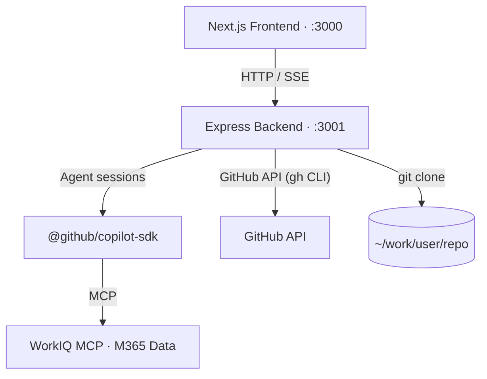

# Web-Spec

**Web-Spec** bridges the gap between business users and AI-powered software development. By wrapping GitHub Copilot's agentic capabilities in a clean, intuitive interface, it empowers product managers, business analysts, and stakeholders to actively participate in the Software Development Lifecycle — no IDE or CLI required.

Simply point it at any GitHub repository, describe what you need, and a chained pipeline of AI agents does the heavy lifting:

- 🔍 **Deep Research** — understands the existing codebase.
- 📋 **PRD Writer** — translates ideas into product requirements.
- 📐 **Technical Docs** — produces developer-ready specifications.

Each agent hands off its output to the next, streaming results in real time. The result? Business users can drive spec creation, align with engineering early, and accelerate delivery — turning GitHub Copilot from a developer tool into a shared team superpower.

---

## Table of Contents

- [Web-Spec](#web-spec)
  - [Table of Contents](#table-of-contents)
  - [Features](#features)
  - [Architecture](#architecture)
  - [Technology Stack](#technology-stack)
  - [Getting Started](#getting-started)
    - [Prerequisites](#prerequisites)
      - [PAT Permissions](#pat-permissions)
    - [Install](#install)
    - [Run](#run)
    - [First-Time Setup](#first-time-setup)
  - [Project Structure](#project-structure)
  - [Agents](#agents)
    - [Agent Pipeline](#agent-pipeline)
    - [Agent Details](#agent-details)
  - [API Reference](#api-reference)
  - [Environment Variables](#environment-variables)
  - [Development](#development)
    - [Hot Reload](#hot-reload)
    - [Root Scripts](#root-scripts)
    - [Adding an Agent](#adding-an-agent)
  - [Testing](#testing)
    - [Type Checking](#type-checking)
    - [Linting](#linting)
    - [Manual Testing](#manual-testing)
  - [Contributing](#contributing)
  - [License](#license)

---

## Features

- **6 AI agents** — Deep Research → PRD Writer → Technical Docs form the analysis pipeline, with Spec Writer, PRD Repo Writer, and Issue Creator as action agents
- **3 action agents** — Spec Writer creates spec branches/PRs, PRD Writer creates PRD docs on repo, Issue Creator creates GitHub issues — all triggered from post-action buttons
- **Repository targeting** — search any GitHub repository; it is cloned automatically and all agents run directly inside it
- **Streaming chat** — real-time server-sent event (SSE) streaming powered by the GitHub Copilot SDK
- **Agent handoff** — forward the output of one agent as context to the next with a single click
- **Knowledge Base (KDB)** — attach Copilot Spaces or external KDB-Vector-Grafo instances to inject reference context into agent sessions
- **WorkIQ integration** — search Microsoft 365 data (emails, meetings, documents, Teams) and attach results as context to agent sessions
- **Dashboard** — session history and activity log persisted in `localStorage`; per-session and bulk delete
- **Admin panel** — view and edit agent YAML configurations (model, tools, prompt) from the browser at `/admin`
- **Feature flags** — toggle visibility of KDB, WorkIQ, and action buttons from the `/settings` page; flags stored in `localStorage`
- **Quick prompts** — one-click prompt buttons on PRD and Technical Docs agents to auto-fill context-based prompts
- **Multi-provider LLM** — choose between GitHub Copilot and Google Vertex AI (Gemini) at runtime via a model selector in the chat input
- **Bitbucket Server support** — clone and search repositories from Bitbucket Server in addition to GitHub, with PAT-based auth and self-signed SSL support
- **Atlassian integration** — search Jira issues and Confluence pages, download them as context documents, and auto-inject into agent sessions alongside existing context sources
- **Parallel context gathering** — all context sources (handoff, Copilot Spaces, WorkIQ, KDB, Atlassian) are fetched concurrently via `Promise.allSettled` — a single source failure never aborts an agent run
- **Server-side auth** — LLM credentials (GitHub PAT, Vertex service account) are configured as backend environment variables — no secrets stored in the browser

---

## Architecture



| Layer | Routes / Responsibilities |
|---|---|
| **Frontend** | `/` Agent selector, `/agents/[slug]` Streaming chat, `/dashboard` Session history, `/kdb` Copilot Spaces, `/settings` Feature flags, `/admin` Agent config editor. Global state via `AppProvider` (React Context) + `localStorage`. |
| **Backend** | `POST /api/repos/clone` — clones via `gh` (GitHub) or `git` (Bitbucket Server), `POST /api/agent/run` — routes to Copilot SDK or Vertex AI and streams SSE tokens, `GET /api/providers/models` — lists available models per provider, `/api/atlassian/*` — Jira/Confluence search, download, and document management. |
| **Copilot SDK** | Agent sessions use `@github/copilot-sdk` to run model inference with tool permissions (grep, glob, bash, etc.) defined in YAML configs. |
| **WorkIQ** | `POST /api/workiq/search` — proxies Microsoft 365 queries (emails, meetings, docs, Teams) via the WorkIQ MCP CLI and attaches results as agent context. |

The **frontend** manages UI, routing, and all client-side state via React context and `localStorage`. It sends repository clone requests and agent run requests to the backend over HTTP.

The **backend** handles repository operations via the GitHub CLI (`gh`) and spawns agent sessions using the `@github/copilot-sdk`. Agent responses are streamed back to the browser as Server-Sent Events (SSE), enabling token-by-token rendering in the chat interface.

The **Copilot SDK** (`@github/copilot-sdk`) powers all agent interactions. Each agent session is configured via a YAML file that specifies the model, system prompt, and tool permissions. The SDK manages the agentic loop — sending prompts, executing tool calls, and streaming token responses back through SSE.

**WorkIQ** integration enables agents to incorporate Microsoft 365 context. Users can search emails, meetings, documents, and Teams messages via the WorkIQ MCP CLI, then attach selected results as additional context for any agent session.

Agent configurations are stored as YAML files in `backend/agents/` and describe the model, system prompt, and tool permissions for each agent.

For detailed Mermaid diagrams covering the system overview, agent run sequence, and agent pipeline, see [ARCHITECTURE.md](ARCHITECTURE.md).

---

## Technology Stack

| Layer | Technology |
|---|---|
| **Frontend framework** | Next.js 14.2.29 |
| **UI language** | React 18, TypeScript 5 |
| **Styling** | Tailwind CSS 3.4 |
| **Icons** | Lucide React 0.462 |
| **Markdown rendering** | react-markdown ^10.1, remark-gfm ^4.0 |
| **Linting** | ESLint |
| **Backend runtime** | Node.js 18+ (ESM) |
| **Backend framework** | Express 4.21 |
| **Backend language** | TypeScript 5 (ES2022, NodeNext) |
| **AI SDK (Copilot)** | @github/copilot-sdk ^0.1.25 |
| **AI SDK (Vertex)** | @google/genai ^1 |
| **MCP client** | @modelcontextprotocol/sdk ^1.27 |
| **Agent config** | YAML 2.8 |
| **Dev tooling** | nodemon, tsx, concurrently ^9 |
| **Monorepo** | npm workspaces |

---

## Getting Started

### Prerequisites

| Requirement | Version | Notes |
|---|---|---|
| Node.js | 18+ | [nodejs.org](https://nodejs.org) |
| GitHub CLI (`gh`) | Latest | [cli.github.com](https://cli.github.com) — must be authenticated (`gh auth login`) |
| GitHub Personal Access Token | — | See token requirements below — [create one](https://github.com/settings/tokens/new) |

#### PAT Permissions

**Classic token** — check these scopes: `repo`, `read:user`, `copilot`

**Fine-grained token** — select the following:
- *Account permissions*: **Copilot Editor Chat** → Read-only
- *Repository permissions*: **Contents** → Read-only, **Metadata** → Read-only (auto-selected)

> Fine-grained tokens must be scoped to your personal account (not just an org) for the Copilot Spaces API to work.

### Install

From the repository root, install dependencies for all workspaces at once:

```bash
npm run install:all
```

Or equivalently:

```bash
npm install --workspaces --include-workspace-root
```

### Run

**Option A — single command from the root (recommended)**

```bash
npm run dev
```

This uses `concurrently` to start both the frontend (port 3000) and backend (port 3001) in a single terminal session.

**Option B — two separate terminals**

```bash
# Terminal 1 — Backend (port 3001)
cd backend
npm run dev
```

```bash
# Terminal 2 — Frontend (port 3000)
cd frontend
npm run dev
```

Then open [http://localhost:3000](http://localhost:3000) in your browser.

### First-Time Setup

1. Configure at least one LLM provider in `backend/.env` (see [Environment Variables](#environment-variables)).
2. Click **Select repo** in the repository bar, search for a GitHub repository, and select it — it will be cloned automatically to `~/work/{owner}/{repo}`.
3. Choose an agent from the landing page, pick a provider/model from the model selector, and start chatting.

---

## Project Structure

```
agentic-web-spec/
├── package.json                    # npm workspaces root (concurrently dev script)
├── README.md
├── frontend/                       # Next.js application (port 3000)
│   ├── package.json
│   ├── tsconfig.json
│   ├── tailwind.config.ts
│   ├── next.config.mjs
│   ├── app/
│   │   ├── layout.tsx              # Root layout — wraps Nav + RepoBar
│   │   ├── page.tsx                # Agent selector landing page
│   │   ├── globals.css
│   │   ├── api/
│   │   │   ├── agent/
│   │   │   │   └── run/
│   │   │   │       └── route.ts    # SSE proxy to backend /api/agent/run
│   │   │   └── backend/
│   │   │       └── workiq/
│   │   │           └── search/
│   │   │               └── route.ts # Proxy to backend /api/workiq/search
│   │   ├── agents/
│   │   │   └── [slug]/
│   │   │       └── page.tsx        # Dynamic agent chat page
│   │   ├── dashboard/
│   │   │   └── page.tsx            # Session history and activity log
│   │   ├── kdb/
│   │   │   └── page.tsx            # Knowledge Base / Copilot Spaces
│   │   ├── settings/
│   │   │   └── page.tsx            # Feature flags toggle panel
│   │   └── admin/
│   │       └── page.tsx            # Agent YAML config editor
│   ├── components/
│   │   ├── ChatInterface.tsx       # Streaming chat UI component
│   │   ├── Nav.tsx                 # Top navigation bar
│   │   ├── RepoBar.tsx             # Active repository status bar
│   │   ├── ModelSelector.tsx        # LLM provider and model picker
│   │   ├── RepoSelectorModal.tsx   # Repository search and clone modal
│   │   ├── ActionPanel.tsx         # Streaming action agent modal
│   │   ├── SpaceSelector.tsx       # Multi-select Copilot Spaces
│   │   ├── WorkIQModal.tsx         # WorkIQ search & context picker
│   │   ├── WorkIQContextChips.tsx  # Attached WorkIQ context display
│   │   └── SettingsDropdown.tsx    # User settings menu
│   └── lib/
│       ├── agents.ts               # Agent definitions and chain order
│       ├── storage.ts              # localStorage read/write helpers
│       ├── context.tsx             # AppProvider — global React context
│       ├── repo-cache.ts           # Repository data caching
│       ├── spaces-cache.ts         # Copilot Spaces cache (5-min TTL)
│       └── workiq.ts               # WorkIQ availability checker
├── backend/                        # Express API server (port 3001)
│   ├── package.json
│   ├── tsconfig.json
│   ├── agents/
│   │   ├── deep-research.agent.yaml
│   │   ├── prd.agent.yaml
│   │   ├── technical-docs.agent.yaml
│   │   ├── spec-writer.agent.yaml
│   │   ├── prd-writer.agent.yaml
│   │   └── issue-creator.agent.yaml
│   └── src/
│       ├── index.ts                # Server entry point
│       ├── lib/
│       │   ├── db.ts               # SQLite database setup and Agent type
│       │   ├── providers.ts        # LLM provider credential reader (env-based)
│       │   ├── copilot-runner.ts   # Copilot SDK agent execution
│       │   ├── vertex-runner.ts    # Vertex AI (Gemini) agent execution
│       │   ├── seed.ts             # Seed agents from YAML on first run
│       │   └── workiq-client.ts    # WorkIQ MCP client singleton
│       └── routes/
│           ├── repos.ts            # Repository clone, search, status, tree endpoints
│           ├── agent.ts            # Agent runner + SSE streaming (provider routing)
│           ├── providers.ts        # Available models per provider endpoint
│           ├── agents.ts           # Full CRUD REST API for agents (/api/agents)
│           ├── kdb.ts              # KDB spaces proxy endpoint
│           ├── workiq.ts           # WorkIQ MCP proxy endpoints
│           └── admin.ts            # Legacy admin endpoints (delegates to DB)
└── reference/                      # Reference materials
```

---

## Agents

Agents are stored in a SQLite database (`backend/data/agents.db`). On first startup, the backend seeds the database from the YAML files in `backend/agents/`. After seeding, the database is the single source of truth. Agents can be managed at runtime via the REST API or the Admin UI at `/admin/agents`.

### Agent Pipeline

```mermaid
flowchart LR
    DR["Deep Research"] -->|hand-off| PRD["PRD Writer"]
    PRD -->|hand-off| TD["Technical Docs"]
    TD -->|action| SW["Spec Writer"]
    TD -->|action| PW["PRD Repo Writer"]
    TD -->|action| IC["Issue Creator"]

    style DR fill:#2d333b,stroke:#539bf5
    style PRD fill:#2d333b,stroke:#539bf5
    style TD fill:#2d333b,stroke:#539bf5
    style SW fill:#2d333b,stroke:#f47067
    style PW fill:#2d333b,stroke:#f47067
    style IC fill:#2d333b,stroke:#f47067
```



The three action agents (Spec Writer, PRD Writer, Issue Creator) are triggered from post-action buttons on the Technical Docs chat page. They receive the tech-docs output as context and execute write operations against the repository.

### Agent Details

| Agent | Slug | Model | Tools | Description |
|---|---|---|---|---|
| **Deep Research** | `deep-research` | o4-mini | grep, glob, view, bash | Analyzes codebase structure, technology constraints, patterns, and dependencies to produce a research report |
| **PRD Writer** | `prd` | o4-mini | grep, glob, view | Consumes research output and generates a structured Product Requirements Document |
| **Technical Docs** | `technical-docs` | o4-mini | grep, glob, view, bash | Produces implementation task breakdowns and technical specifications based on the PRD |
| **Spec Writer** | `spec-writer` | gpt-4.1 | bash | Action agent: creates a spec branch with spec.md and story files, commits, and opens a PR |
| **PRD Writer (Repo)** | `prd-writer` | gpt-4.1 | bash | Action agent: creates a PRD markdown file on a branch and opens a PR |
| **Issue Creator** | `issue-creator` | gpt-4.1 | bash | Action agent: creates hierarchical GitHub issues (parent + sub-issues) via `gh` CLI |

---

## API Reference

All API endpoints are served by the backend on port `3001`.

| Method | Endpoint | Description |
|---|---|---|
| `POST` | `/api/repos/clone` | Clone a repository into `~/work/{owner}/{repo}` |
| `GET` | `/api/repos/status` | Check whether a repository has already been cloned |
| `DELETE` | `/api/repos/remove` | Remove a cloned repository from the work directory |
| `GET` | `/api/repos/tree` | Return the file tree of a cloned repository |
| `GET` | `/api/repos/search?q=` | Search GitHub repositories (server-side PAT) |
| `GET` | `/api/repos/me` | Get authenticated GitHub username from env PAT |
| `POST` | `/api/agent/run` | Start an agent session and stream token output via SSE (accepts `provider` + `model`) |
| `GET` | `/api/providers/models` | List available models grouped by configured provider |
| `GET` | `/api/kdb/spaces` | Proxy endpoint to fetch GitHub Copilot Spaces (eliminates CORS errors) |
| `POST` | `/api/workiq/search` | Search Microsoft 365 data via WorkIQ MCP |
| `GET` | `/api/workiq/status` | Check if WorkIQ CLI is available |
| `GET` | `/api/agents` | List all agents (DB-backed) |
| `GET` | `/api/agents/:slug` | Get a single agent |
| `POST` | `/api/agents` | Create a new agent |
| `PUT` | `/api/agents/:slug` | Update an agent |
| `DELETE` | `/api/agents/:slug` | Delete an agent |
| `GET` | `/api/admin/agents` | Legacy: list agents (delegates to DB) |
| `GET` | `/api/admin/agents/:slug` | Legacy: get agent (delegates to DB) |
| `PUT` | `/api/admin/agents/:slug` | Legacy: update agent (delegates to DB) |
| `GET` | `/health` | Health check — returns `200 OK` |
| `POST` | `/api/backend/workiq/search` | Frontend proxy route — forwards WorkIQ search requests to the backend (90 s timeout) |

---

## Environment Variables

Environment variables are consumed by the **backend** only. Create a `.env` file in the `backend/` directory.

| Variable | Default | Description |
|---|---|---|
| `PORT` | `3001` | Port the Express server listens on |
| `WORK_DIR` | `~/work` | Base directory where repositories are cloned |
| `GITHUB_PAT` | — | GitHub Personal Access Token (enables Copilot provider, repo clone, Copilot Spaces) |
| `VERTEX_SERVICE_ACCOUNT_B64` | — | Base64-encoded Google Cloud service account JSON (enables Vertex AI provider) |
| `VERTEX_LOCATION` | `us-central1` | Google Cloud region for Vertex AI requests |
| `BITBUCKET_SERVER_URL` | — | Bitbucket Server base URL (e.g., `https://bitbucket.example.com`) |
| `BITBUCKET_PAT` | — | Bitbucket Server Personal Access Token |
| `JIRA_URL` | — | Jira Server base URL (e.g., `https://jira.example.com`) |
| `JIRA_PAT` | — | Jira Server Personal Access Token |
| `CONFLUENCE_URL` | — | Confluence Server base URL (e.g., `https://confluence.example.com`) |
| `CONFLUENCE_PAT` | — | Confluence Server Personal Access Token |
| `ALLOW_SELF_SIGNED_SSL` | `false` | Set to `true` to allow self-signed SSL certificates (for on-prem Bitbucket/Jira/Confluence) |

At least one LLM provider (`GITHUB_PAT` or `VERTEX_SERVICE_ACCOUNT_B64`) must be configured. The frontend requires no environment variables — all credentials are kept server-side.

---

## Development

### Hot Reload

- **Frontend** — Next.js provides fast refresh out of the box. Any change to a component or page is reflected immediately in the browser without a full reload.
- **Backend** — `nodemon` watches for file changes and `tsx` handles TypeScript compilation on the fly. The server restarts automatically on any `.ts` file change in `src/`.

### Root Scripts

| Script | Description |
|---|---|
| `npm run dev` | Start both frontend and backend concurrently |
| `npm run build` | Build the frontend for production |
| `npm run install:all` | Install dependencies for all workspaces |

### Adding an Agent

Agents can now be added at runtime through the Admin UI at `/admin/agents` or via the REST API:

```bash
curl -X POST http://localhost:3001/api/agents \
  -H 'Content-Type: application/json' \
  -d '{"slug":"my-agent","name":"my-agent","displayName":"My Agent","prompt":"You are..."}'
```

Alternatively, add a YAML file to `backend/agents/` and delete `backend/data/agents.db` — the seed will recreate it on next startup.

---

## Testing

There are currently no automated test suites in this project. Verification is done through static analysis and manual end-to-end checks.

### Type Checking

Run the TypeScript compiler in no-emit mode against each package to catch type errors without producing build output:

```bash
# Frontend
cd frontend && npx tsc --noEmit

# Backend
cd backend && npx tsc --noEmit
```

### Linting

```bash
# Frontend (ESLint via Next.js)
cd frontend && npm run lint
```

### Manual Testing

After starting the app with `npm run dev`, verify the following flows:

| Flow | Steps |
|---|---|
| **Auth** | Configure `GITHUB_PAT` and/or `VERTEX_SERVICE_ACCOUNT_B64` in `backend/.env` → restart backend → confirm model selector shows available providers |
| **Repo clone** | Click **Select repo** → search for a public repo → select it → confirm it appears in the repo bar |
| **Agent run** | Pick any agent → type a prompt → confirm streamed tokens appear in the chat |
| **Agent handoff** | Complete a Deep Research session → click **Send to PRD Writer** → confirm context is prepopulated in the new session |
| **KDB attach** | Navigate to `/kdb` → connect a Copilot Space → start an agent session and confirm the space context is included |
| **Dashboard** | Navigate to `/dashboard` → confirm past sessions and activity events are listed |
| **WorkIQ** | Click the WorkIQ button in chat → search → attach a result → send a message → confirm context is included |
| **Admin** | Navigate to `/admin` → view agent list → edit an agent's prompt → save → confirm YAML file is updated |
| **Feature flags** | Navigate to `/settings` → toggle a flag off → confirm the corresponding UI element is hidden |
| **Action agents** | Complete a Technical Docs session → click "Create Docs on Repo" → confirm ActionPanel streams the spec-writer agent |

---

## Contributing

1. Fork the repository and create a feature branch: `git checkout -b feat/your-feature`
2. Make your changes, ensuring code follows the existing TypeScript and ESLint conventions.
3. Run `npm run dev` and manually test affected flows.
4. Open a pull request with a clear description of the change and its motivation.

---

## License

MIT License. See [LICENSE](LICENSE) for details.
